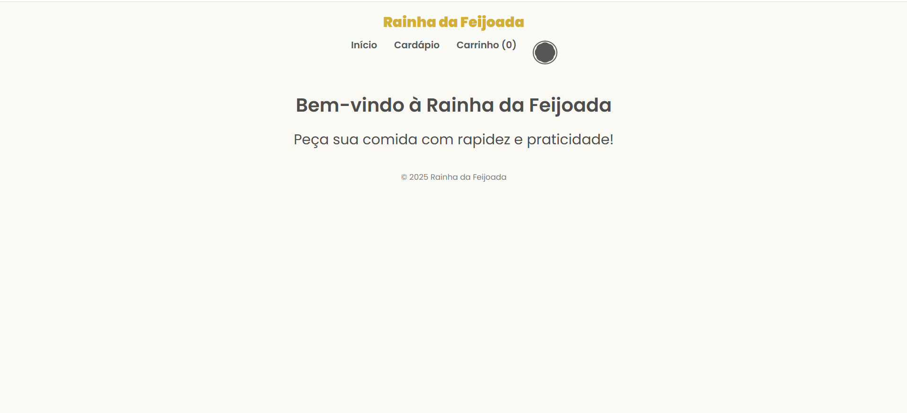
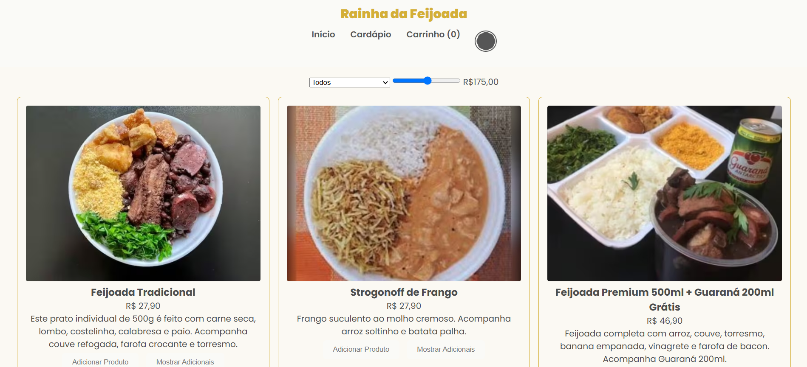
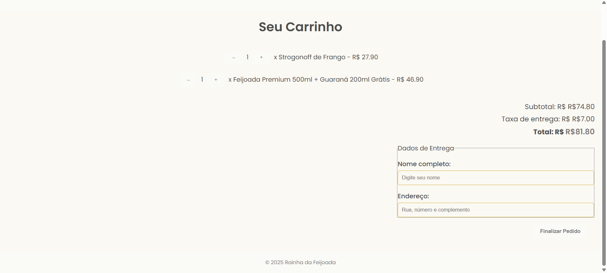
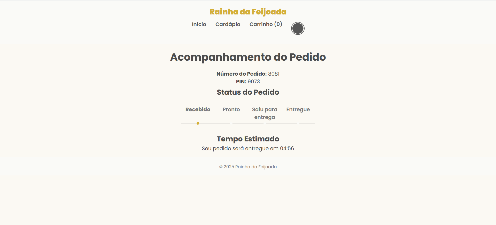
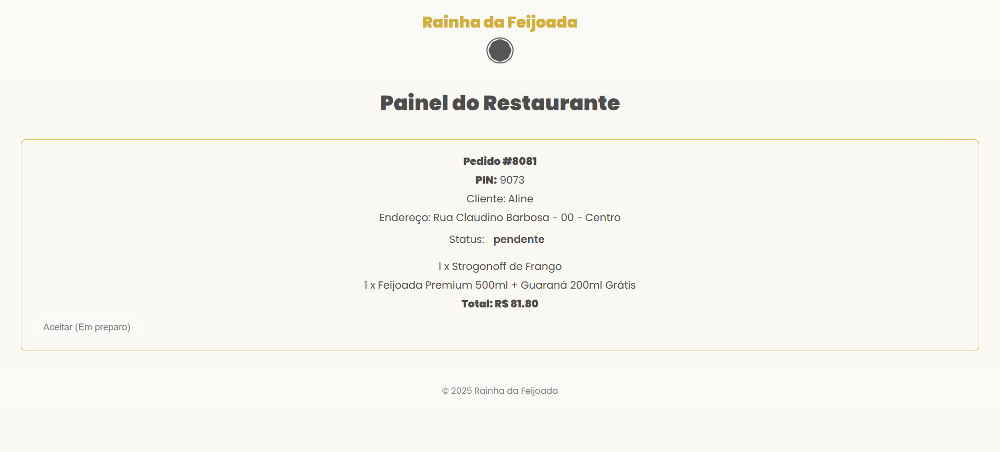
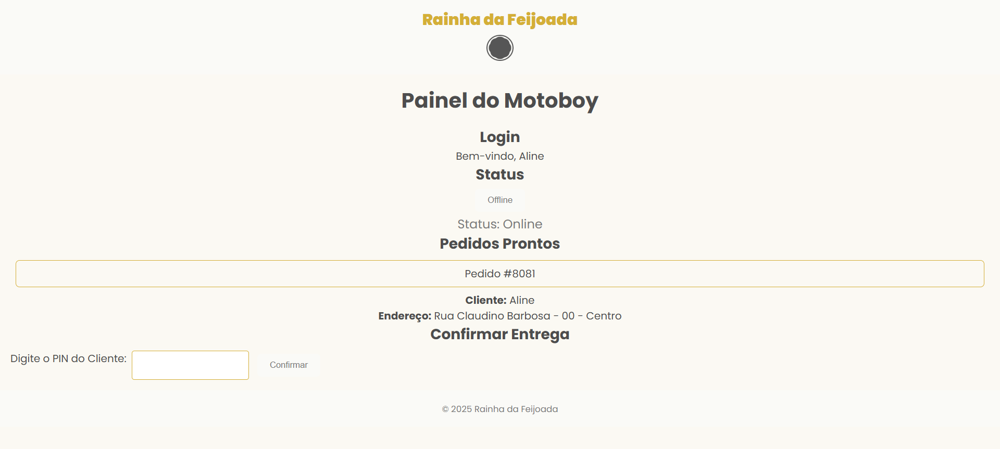

# 🍛 Rainha da Feijoada - Sistema Delivery
Sistema completo de delivery online para o restaurante **Rainha da Feijoada**, desenvolvido com HTML, CSS e JavaScript. O projeto simula todas as etapas de um pedido: escolha dos pratos, carrinho, acompanhamento em tempo real, painel do restaurante e painel do motoboy.
_ _ _

## Sumário
- [🧩 Funcionalidades](#-funcionalidades)
- [🖼️ Preview das Páginas](#️-preview-das-páginas)
- [💻 Tecnologias Utilizadas](#-tecnologias-utilizadas)
- [📁 Estrutura do Projeto](#-estrutura-do-projeto)
- [🚀 Melhorias Futuras](#-melhorias-futuras)
- [🙏 Agradecimentos](#-agradecimentos)
_ _ _ 

# 🔗 Acesse o Projeto Online
- [Projeto Delivery](https://devseravali.github.io/projeto-delivery/)

- [Painel do Restaurante](https://devseravali.github.io/projeto-delivery/restaurante.html)

- [Painel do Motoboy](https://devseravali.github.io/projeto-delivery/motoboy.html)
_ _ _

## 🧩 Funcionalidades
- ✅ Vizualização de cardápio com filtros por tipo e preço
- 🛒 Carrinho com subtotal, taxa de entrega dinâmica e formulário de endereço
- 🧾 Geração de pedido com PIN único e salvamento no 'localStorage'
- 🔁 Acompanhamento visual do pedido com barra de progresso
- 🍽️ Painel do Restaurante com lista de pedidos e atualização de status
- 🛵 Painel do Motoboy com login, nome/endereco do cliente e confirmação via PIN
- 🌗 Suporte a tema claro/escuro
_ _ _

## 🖼️ Preview das Páginas
| Página | Descrição | Preview |
|--------|-----------|---------|
| **Início** (`index.html`) | Página inicial com boas-vindas e chamada para ação. |  |
| **Cardápio** (`cardapio.html`) | Lista de produtos com filtro por categoria e preço. | |
| **Carrinho** (`carrinho.html`) | Itens adicionados, total e dados de entrega. |  |
| **Acompanhamento** (`acompanhamento.html`) | Mostrar status do pedido e PIN de acompanhamento. |  |
| **Painel do Restaurante** (`restaurante.html`) | Lista pedidos com botões de atualização de status. |  | 
|  **Painel do Motoboy** (`motoboy.html`) | Login, pedidos prontos e confirmação por PIN |  |
_ _ _

## 💻 Tecnologias Utilizadas
- **HTML5** - Estrutura semântica das páginas 
- **CSS3** - Estilização, variáveis, temas e responsividade
- **JavaScript (ES6+)** -  Lógica de negócio, eventos,   `localStorage`
- **Mobile First** - Responsivo para tamanhos: `1024px`, `768px`, `480px`
_ _ _

## 📁 Estrutura do Projeto
```text
projeto-delivery/
├─ index.html
├─ cardapio.html
├─ carrinho.html
├─ acompanhamento.html
├─ restaurante.html
├─ motoboy.html
├─ src/
│  ├─ css/
│  │  ├─ reset.css
│  │  ├─ style.css
│  │  ├─ variables.css
│  │  └─ responsivo.css
│  └─ js/
│     ├─ index.js
│     ├─ cardapio.js
│     ├─ carrinho.js
│     ├─ acompanhamento.js
│     ├─ restaurante.js
│     ├─ motoboy.js
│     └─ produtos.js
└─ previews/
   ├─ preview-index.png
   ├─ preview-cardapio.png
   ├─ preview-carrinho.png
   ├─ preview-acompanhamento.png
   ├─ preview-restaurante.png
   └─ preview-motoboy.png
```
_ _ _

## 🚀 Melhorias Futuras
- Integração com backend (ex: Firebase ou API REST)
- Autenticação real do motoboy e restaurante 
- Validação de endereço por CEP (API ViaCEP ou Google Maps)
- Tela de admnistrador com todos os pedidos 
- Sistema de avaliação pós-entrega 

_ _ _

## 🧑‍🍳 Projeto Acadêmico
Esse projeto foi desenvolvido como parte de um estudo prático sobre desenvolvimento web front-end, simulando um sistema completo de delivery com interfaces independentes para cliente, restaurante e entregador.
_ _ _ 

## 🙏 Agradecimentos
A todos que apoiam o aprendizado contínuo em desenvolvimento web.  
Esse projeto foi criado como exercício prático de front-end, com foco em aplicações reais e simulação de sistemas completos.  
Especial agradecimento às plataformas de estudo que contribuíram para o progresso desta aplicação.
